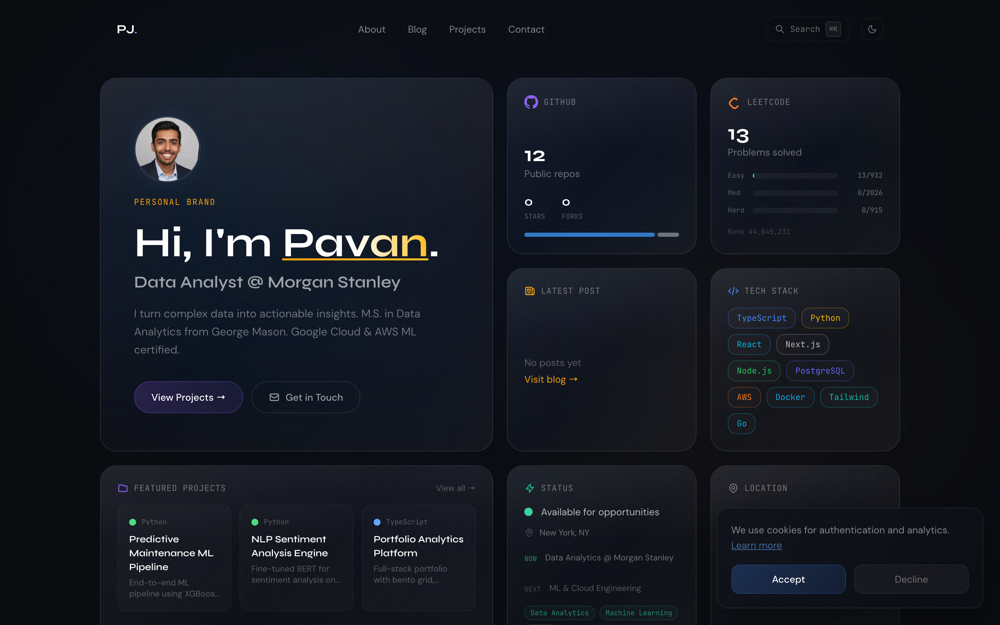
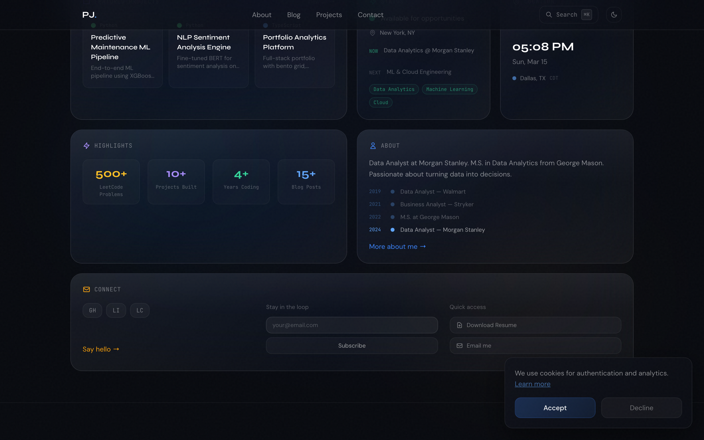
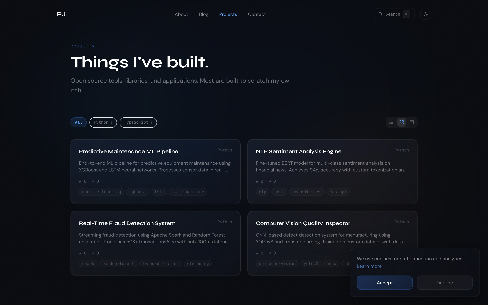
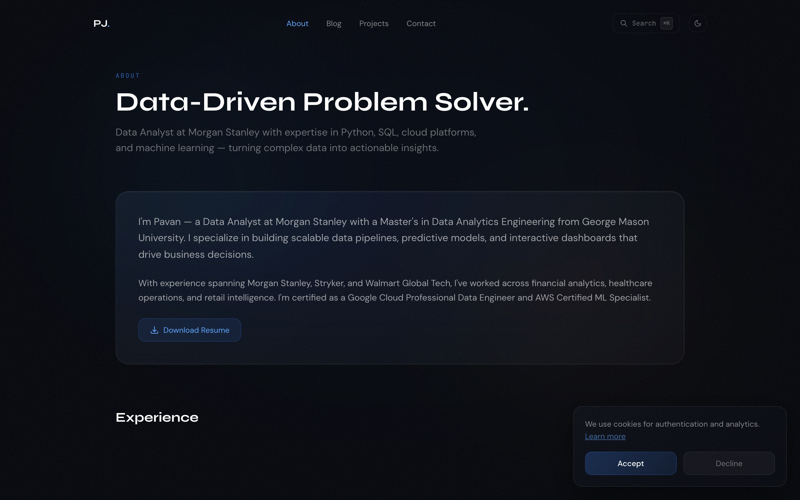
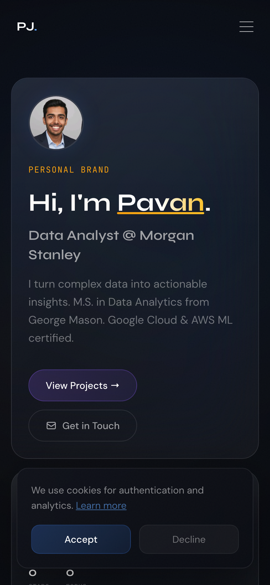

<div align="center">

# Pavan Jillella — Portfolio & Life Dashboard

**Full-stack personal portfolio and life dashboard built with Next.js 14, Supabase, and TypeScript.**

Featuring real-time analytics, a CMS-powered About page, and Apple-inspired glassmorphism UI.

[](https://nextjs.org/)
[](https://typescriptlang.org/)
[](https://tailwindcss.com/)
[](https://supabase.com/)

</div>

---

## Preview

### Homepage — Bento Grid





### Projects



### About



### Mobile

<p align="center">
  
</p>

---

## Tech Stack

| Layer | Technology |
|-------|-----------|
| **Framework** | Next.js 14 (App Router) |
| **Language** | TypeScript |
| **Styling** | Tailwind CSS, Apple-style glassmorphism |
| **Animations** | Framer Motion |
| **Backend / Auth** | Supabase (Postgres, Auth, Real-time sync) |
| **Data Fetching** | React Query (TanStack Query) |
| **APIs** | GitHub REST API, LeetCode GraphQL API |
| **Deployment** | Vercel |
| **PWA** | next-pwa |

---

## Key Features

**Public Homepage**
- Apple-inspired bento grid layout with frosted glass cards
- Live GitHub contribution stats and LeetCode activity cards
- Featured projects, tech stack, highlights, clock, and status cards
- Dynamic location display, career timeline, and contact section
- Fully responsive — desktop, tablet, and mobile

**About Page (CMS-powered)**
- Bio, experience, education, skills, and timeline sections
- Editable from a private dashboard editor
- Resume download and photo upload support

**Private Dashboard**
- Personal analytics: correlation charts, growth index, heatmaps
- GitHub event timeline and LeetCode breakdown with donut chart
- Study session tracker and knowledge graph
- Finance tracker, habit tracker, education dashboard
- Life index, roadmap planner, and activity feed
- Settings page with dynamic location, profile, and account management

**Design**
- Deep frosted glass (`blur(40px)` + `saturate(180%)`) with top-edge light refraction
- Color-coded ambient glow on card hover (blue, amber, violet, emerald, orange)
- Shine sweep animation on hero card
- Dark mode by default with light mode support
- Syne + DM Sans + JetBrains Mono typography

---

## Getting Started

```bash
# Clone the repo
git clone https://github.com/Pavan-jillella/portfolio.git
cd portfolio

# Install dependencies
npm install

# Set up environment variables
cp .env.example .env.local
# Add your Supabase URL, anon key, and other API keys

# Run the dev server
npm run dev
```

Open https://pavanjillella.vercel.app to view it.

---

## Project Structure

```
src/
├── app/
│   ├── page.tsx                  # Homepage (bento grid)
│   ├── about/                    # About page
│   ├── projects/                 # Projects page
│   ├── contact/                  # Contact page
│   ├── blog/                     # Blog
│   ├── education/                # Education dashboard
│   ├── finance/                  # Finance tracker
│   ├── dashboard/                # Private dashboard
│   │   ├── about/                # About CMS editor
│   │   ├── analytics/            # Personal analytics
│   │   ├── habits/               # Habit tracker
│   │   ├── life-index/           # Life index
│   │   └── activity/             # Activity feed
│   ├── settings/                 # Account settings
│   └── api/                      # API routes
├── components/
│   ├── bento/                    # Bento grid cards
│   ├── analytics/                # Charts, heatmaps, graphs
│   ├── sections/                 # Full-page sections
│   ├── providers/                # Auth, theme, query providers
│   └── ui/                       # Reusable primitives
├── hooks/
│   ├── queries/                  # React Query hooks (GitHub, LeetCode)
│   └── useLocalStorage.ts        # Local storage hook
├── lib/
│   ├── constants.ts              # Social links, config
│   └── supabase/                 # Supabase client setup
└── types/
    └── index.ts                  # TypeScript interfaces
```

---

## Environment Variables

```env
NEXT_PUBLIC_SUPABASE_URL=your_supabase_url
NEXT_PUBLIC_SUPABASE_ANON_KEY=your_supabase_anon_key
```

---

## License

This project is open source and available under the [MIT License](LICENSE).

---

<div align="center">

**Built by [Pavan Jillella](https://www.linkedin.com/in/pavan-jillella)**

</div>
